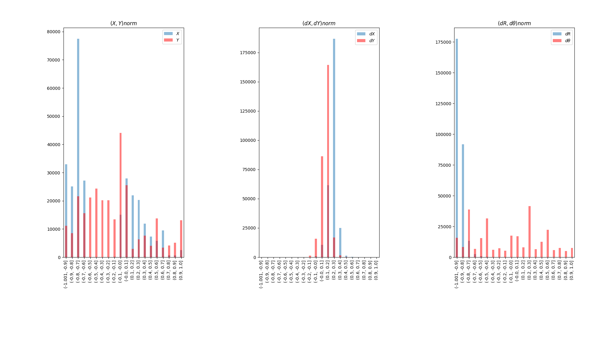

# motion-pred-clustbased

**augmentation branch can be updated at anytime**


PyTorch(v1.12.0) implementation of [Likely, Light, and Accurate Context-Free Clusters-based Trajectory Prediction](https://ieeexplore.ieee.org/abstract/document/10422479).


## Current status

* Data sets
  * [x] Argoverse
    * [x] Extraction
    * [x] Preprocessing
  * [x] THÖR - Preprocessing
  * [x] Benchmark - Preprocessing 

* Inputs 
  * [x] X, Y
  * [x] dX, dY
  * [x] R, $\theta$
  * [x] dR, d$\theta$

* Data Analysis
  * [x] Transforms visualization
  * [x] 2D Histograms -> inputs range
  * [x] Histograms -> inputs by interval
  * [x] Histograms -> time step
  * [x] Trip Length
  * [x] Statistics
    * [x] [Straightness Index](https://link.springer.com/content/pdf/10.1007/s10109-021-00370-6.pdf)
    * [x] avg, std 

* Clustering based on full trajectory
  * [x] k-means
    * [x] visualization on TB
    * [x] metrics (SSE and silhouette score)
    * [x] Elbow method
  * [x] DBSCAN
    * [x] visualization on TB
    * [x] metrics (silhouette score, avg_distance based on knn)
    * [x] Fréchet-distance
  * [x] [HDBSCAN](https://github.com/scikit-learn-contrib/hdbscan)
    * [x] visualization on TB
    * [x] metrics (silhouette score)
    * [x] Fréchet-distance
  * [x] Self-Conditioned GAN
    * [x] Discriminator based on predicted trajectory
    * [x] Discriminator based on full trajectory
    * [x] Elbow
      * [x] silhouette coef. based

* Forecasters
  * [x] [CVM](https://arxiv.org/pdf/1903.07933.pdf)
  * [x] [RED predictor](https://openaccess.thecvf.com/content_ECCVW_2018/papers/11131/Becker_RED_A_simple_but_effective_Baseline_Predictor_for_the_TrajNet_ECCVW_2018_paper.pdf)
  * [x] [Vanilla GAN](https://github.com/vita-epfl/trajnetplusplusbaselines)
  * [x] Vanilla VAE
  * [x] cVAE conditioned on supervised classes (when available)
  * [x] cGAN based on [Vanilla GAN](https://github.com/vita-epfl/trajnetplusplusbaselines)
  * [x] CVAE-based (clust. cond.)
  * [x] CGAN-based Ours (clust. cond.)
  
* Augmentation
  * [x] Plot displacements
  * [x] Plot translated trajectories 
  * [x] sc-GAN generating synthetic data
    * [x] Tested in THÖR
    * [ ] Tested in Argorverse
    * [ ] Tested in Benchmark
  * [x] FT-GAN generating synthetic data
    * [x] Tested in THÖR
    * [ ] Tested in Argorverse
    * [ ] Tested in Benchmark


## Installation

Install [miniconda](http://docs.conda.io/en/latest/miniconda.html). Then, you can install all packages required by running:


```
conda env create -f environment.yml
```

```
conda activate mpc
```

```
pip3 install torch torchvision torchaudio --extra-index-url https://download.pytorch.org/whl/cpu
```

```
cd motion-pred-clustbased && pip install .
```


## Datasets extraction and preprocessing

* Benchmark

Define [cfg file settings](https://github.com/tmralmeida/motion-pred-clustbased/blob/27-10-remove-clust-loss/motion_pred_clustbased/cfg/preprocessing/benchmark.yaml). Run:

```
python -m motion_pred_clustbased.datasets.utils.preprocess --cfg motion_pred_clustbased/cfg/preprocessing/benchmark.yaml
```

* Argoverse

Define [cfg file settings](https://github.com/tmralmeida/motion-pred-clustbased/blob/27-10-remove-clust-loss/motion_pred_clustbased/cfg/preprocessing/argoverse.yaml). First, run:

```
python -m motion_pred_clustbased.datasets.utils.extract_argoverse
```

Then, run:

```
python -m motion_pred_clustbased.datasets.utils.preprocess --cfg motion_pred_clustbased/cfg/preprocessing/argoverse.yaml
```

* THÖR 

First, run [pythor-tools](https://github.com/tmralmeida/pythor-tools). To do so, define the [cfg file](https://github.com/tmralmeida/pythor-tools/blob/main/cfg/ds_params.yaml)
and extract the dataset according to the [README](https://github.com/tmralmeida/pythor-tools/blob/main/README.md).

Then, run:

```
python -m motion_pred_clustbased.datasets.utils.preprocess --cfg motion_pred_clustbased/cfg/preprocessing/thor.yaml
```

**Note:** ETH has a different frame rate. (accelerated video)
## Data Analysis

The Data Analysis branch comprises 3 different types of analysis: transformation assertion (normalization and polar/cartesian coordinates), input features analysis through histograms, 
and statistical analysis.

### Assert Transformations

To run the transformation assertion on UNIV:
```
python -m motion_pred_clustbased.data_analysis.assert_transforms --cfg motion_pred_clustbased/cfg/data_analysis/benchmark.yaml
```

This would output:

<p>
    
</p>

The first row shows the original spaces, the second row depicts the normalization procedure (see axis) and the third row demonstrates the inverse transformation to the original space.

### Analysis through histograms
Through this analysis, one can see frequency maps of the input features. Example (`hist_type : input_frequency` in the [cfg file](https://github.com/tmralmeida/motion-pred-clustbased/blob/27-10-remove-clust-loss/motion_pred_clustbased/cfg/data_analysis/benchmark.yaml)):

```
python -m motion_pred_clustbased.data_analysis.histograms --cfg motion_pred_clustbased/cfg/data_analysis/benchmark.yaml
```
Visual examples from THÖR (upper) and UNIV (bottom) data sets:

<p></p>
<p></p>

Another example is the counting of input features per interval. Visual Example (`hist_type : cnt_per_interval` in the [cfg file](https://github.com/tmralmeida/motion-pred-clustbased/blob/27-10-remove-clust-loss/motion_pred_clustbased/cfg/data_analysis/benchmark.yaml)):

<p></p>

Analougsly, we compute the same step-wise stats. Visual example (`hist_type : step_wise` in the [cfg file](https://github.com/tmralmeida/motion-pred-clustbased/blob/27-10-remove-clust-loss/motion_pred_clustbased/cfg/data_analysis/benchmark.yaml)):

<p></p>

Finally, we also compute trip length statistics (`hist_type : trip_length` in the [cfg file](https://github.com/tmralmeida/motion-pred-clustbased/blob/27-10-remove-clust-loss/motion_pred_clustbased/cfg/data_analysis/benchmark.yaml)):

<p></p>


### Statistical Analysis

To run the statistical analysis ([Straightness Index](https://link.springer.com/content/pdf/10.1007/s10109-021-00370-6.pdf), average and standard deviation of input features)
on Argoverse:

```
python -m motion_pred_clustbased.data_analysis.stats --cfg motion_pred_clustbased/cfg/data_analysis/argoverse.yaml
```

## Clustering

This repo provides clustering methods in two different data spaces: input space (trajectory) and feature space (via [Self-Conditioned GAN](https://github.com/stevliu/self-conditioned-gan) adapted to trajectories generation).

Config files can be found in the respective [directory](https://github.com/tmralmeida/motion-pred-clustbased/tree/27-10-remove-clust-loss/motion_pred_clustbased/cfg/clustering).

### Trajectory Space

First, one needs to edit the [config file](https://github.com/tmralmeida/motion-pred-clustbased/tree/27-10-remove-clust-loss/motion_pred_clustbased/cfg/clustering/raw) comprising the settings of the clustering. 
Through the [`default.yaml`](https://github.com/tmralmeida/motion-pred-clustbased/blob/27-10-remove-clust-loss/motion_pred_clustbased/cfg/clustering/raw/default.yaml) file, one can select the clustering algorithm to use: [k-means with `type`: `normal`](https://link.springer.com/referenceworkentry/10.1007/978-0-387-30164-8_425), [k-shape](http://www1.cs.columbia.edu/~jopa/Papers/PaparrizosSIGMOD2015.pdf) implemented via [tslearn](https://tslearn.readthedocs.io/en/stable/gen_modules/clustering/tslearn.clustering.KShape.html), and [k-means with `type`: `time_series`](https://tslearn.readthedocs.io/en/stable/gen_modules/clustering/tslearn.clustering.TimeSeriesKMeans.html#tslearn.clustering.TimeSeriesKMeans), and the respective hyperparameters. **Note:** elbow method can be run in each algorithm (`elbow` key). 

Then, to run the respective clustering method on Argoverse e.g.: 

```
python -m motion_pred_clustbased.clustering.raw_data.run --cfg motion_pred_clustbased/cfg/clustering/raw/argoverse.yaml 
```


### Feature Space

First, one needs to edit the [config file](https://github.com/tmralmeida/motion-pred-clustbased/tree/27-10-remove-clust-loss/motion_pred_clustbased/cfg/clustering/feature_space) comprising the settings of the Self-Conditioned GAN. 
Here, the dataset and hyperparameters must be specified. Furthermore, the `best_metric` key defines the stopping criteria.


Then, to run the `sc-gan` (Self-Conditioned GAN) method on the benchmark e.g., run:

```
python -m motion_pred_clustbased.clustering.feature_space.run --cfg motion_pred_clustbased/cfg/clustering/feature_space/benchmark.yaml
```


There is also the possibility of running the elbow method, through:


```
python -m motion_pred_clustbased.clustering.feature_space.run_elbow --cfg motion_pred_clustbased/cfg/clustering/feature_space/benchmark.yaml
```


## Predictors

To run the predictors (3 variants of the [Constant Velocity model](https://github.com/boschresearch/the-atlas-benchmark)) on the test set, one 
needs to configure the respective model's [settings](https://github.com/tmralmeida/motion-pred-clustbased/tree/27-10-remove-clust-loss/motion_pred_clustbased/cfg/predict).

Then, to run the respective CVM:

```
python -m motion_pred_clustbased.predictors.cvm --cfg motion_pred_clustbased/cfg/predict/argoverse/cvm.yaml
```

## Trainers

* ***[RED predictor](https://openaccess.thecvf.com/content_ECCVW_2018/papers/11131/Becker_RED_A_simple_but_effective_Baseline_Predictor_for_the_TrajNet_ECCVW_2018_paper.pdf)***


To train the RED predictor on THÖR:

```
python -m motion_pred_clustbased.train --cfg motion_pred_clustbased/cfg/training/thor/van_det.yaml
```

*  ***[Vanilla GAN](https://github.com/vita-epfl/trajnetplusplusbaselines)***

To train the vanilla GAN on THÖR:

```
python -m motion_pred_clustbased.train --cfg motion_pred_clustbased/cfg/training/thor/van_gan.yaml
```


* ***Vanilla VAE***
To train the vanilla GAN on THÖR:

```
python -m motion_pred_clustbased.train --cfg motion_pred_clustbased/cfg/training/thor/van_vae.yaml
```


* ***cVAE*** conditioned on supervised classes (when available)

To train the supervised conditioned VAE on THÖR:

```
python -m motion_pred_clustbased.train --cfg motion_pred_clustbased/cfg/training/thor/cvae.yaml
```

* ***cGAN*** based on [Vanilla GAN](https://github.com/vita-epfl/trajnetplusplusbaselines)


To train the supervised conditioned GAN on THÖR:

```
python -m motion_pred_clustbased.train --cfg motion_pred_clustbased/cfg/training/thor/cgan.yaml
```

*  **Ours (dist-based)**

To train a conditional context-free deep generative trajectory forecaster on THÖR:

```
python -m motion_pred_clustbased.train --cfg motion_pred_clustbased/cfg/training/thor/gan_clust_based/dist_based.yaml
```

This will train a model that outputs the trajectories and the respective likelihoods based on the distance to the centroids or
the distance to the closest `n_neighbors`.

*  **Ours (anet-based)**


To train a conditional context-free deep generative trajectory forecaster on THÖR based on an auxiliary network:

```
python -m motion_pred_clustbased.train_anet --cfg motion_pred_clustbased/cfg/training/thor/gan_clust_based/anet_based.yaml
```
This will train a model that outputs the trajectories and the respective likelihoods based on the auxiliary network. This network
aims to learn the correct activated clusters based on a set of trajectories coming from each cluster.


## Augmentation

To create a synthetic THÖR dataset based on sc-GAN, and train an anet-conditioned deep generative trajectory forecaster:

```
python -m motion_pred_clustbased.augmentation.train --model_cfg motion_pred_clustbased/cfg/training/thor/ours_anet_based.yaml --synt_gen_cfg motion_pred_clustbased/cfg/clustering/feature_space/thor.yaml
```

To create a synthetic THÖR dataset based on FT-GAN, and train an anet-conditioned deep generative trajectory forecaster:

```
python -m motion_pred_clustbased.augmentation.train --model_cfg motion_pred_clustbased/cfg/training/thor/ours_anet_based.yaml --synt_gen_cfg motion_pred_clustbased/cfg/augmentation/thor_ft_gan.yaml
```

To plot the alignment between the original training and test sets and the synthetic dataset, toggle the `plots` variable to `True` in the respective configuration files.  

# Citation

```
@INPROCEEDINGS{10422479,
  author={de Almeida, Tiago Rodrigues and Mozos, Oscar Martinez},
  booktitle={2023 IEEE 26th International Conference on Intelligent Transportation Systems (ITSC)}, 
  title={Likely, Light, and Accurate Context-Free Clusters-based Trajectory Prediction}, 
  year={2023},
  volume={},
  number={},
  pages={1269-1276},
  keywords={Uncertainty;Clustering methods;Roads;Probabilistic logic;Generative adversarial networks;Trajectory;Proposals},
  doi={10.1109/ITSC57777.2023.10422479}}
```